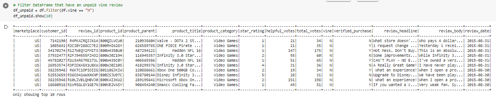

# Amazon_Vine_Analysis

## Overview of the analysis: Explain the purpose of this analysis.
In this project we analyzed Amazon Vine review program in order to determine if there is a bias toward favorable revies from Vine members.
The analysis was performed on video games and PysSpark was used in order to perform the ETL process to extract the dataset from AWS, transform the data with the desired columns that the client asked, connect to an AWS RDS instance and load the transformed data into pdAdmin and calculate different metrics.
## Resources
Data: Amazon Review Datasets, Video Games Reviews
Software: Google Colab, PostgreSQL 11.5, AWS.

## ETL process
### Extract
Read the url form Amazon S3 drive and extract the data into a DataFrame.
 

### Transform
Transform the data in order to fit the desired columns:
* Customers: 
  * Customer id.
  * Customer Count.
* Products:
  * Product id.
  * Product title.
* Reviews:
  * Review id.
  * Customer id.
  * Producto id.
  * Product parent.
  * Review date.
 
 

### Load
Load the data to a RDS in Amazon Web Services.
 

## Results: Using bulleted lists and images of DataFrames as support, address the following questions:
### Vine Reviews
 

### non-Vine Reviews
 

### Insights
* There are **94** *paid reviews* (Vine reviews) and **40,471** *unpaid reviews.*
* There are **48** *5-star paid reviews* and **15,663** *5-starunpaid reviews.*
* **51.06%** of *paid reviews* had 5-stars.
* **38.7%** of *unpaid reviews* had 5-stars.
## Summary
As shown in the results of the previous analysis, the percentage of 5-star vine reviews is 12.36% higher than the percentage of 5-star unpaid reviews, and by further analyzing the reviews, we can see that there is only one paid review with one star whereas there are over 10,000 unpaid reviews, having **24%** more "bad reviews", so we can infer by this that there is a bias regarding the vine reviews.
